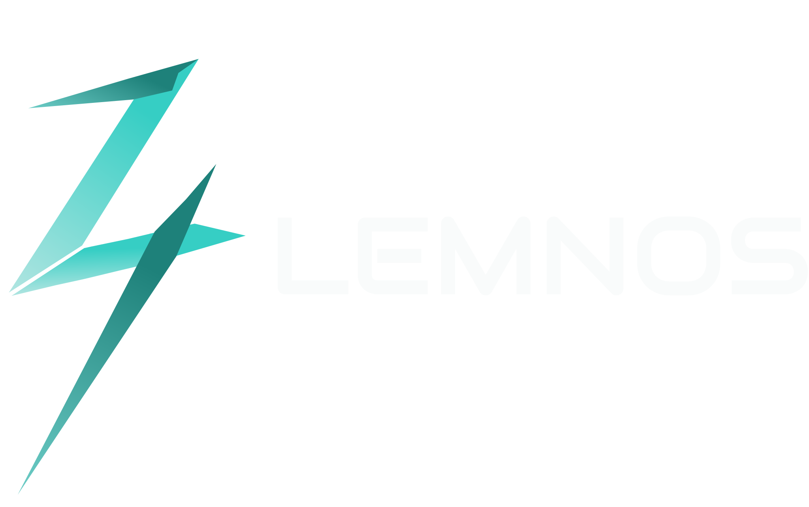

# Lemnos

### **🚧 Atenção: Este projeto está em desenvolvimento. A API externa está atualmente fora do ar.**

Este é um projeto de e-commerce de tecnologia desenvolvido em React como parte do Trabalho de Conclusão de Curso (TCC). O projeto inclui uma variedade de funcionalidades avançadas para proporcionar uma experiência de usuário completa e envolvente.


## Índice
- <a href="#%EF%B8%8F-tecnologias-utilizadas">Tecnologias Utilizadas</a>
- <a href="#-funcionalidades">Funcionalidades</a>
- <a href="#-estrutura-do-projeto">Estrutura do Projeto</a>
- <a href="#-como-executar-o-projeto">Como Executar o Projeto</a>
- <a href="#-planos-futuros">Planos Futuros</a>
- <a href="#-contato">Contato</a>

## 🛠️ Tecnologias Utilizadas
**React:** Biblioteca principal para construção da interface.  
**Vite:** Ferramenta de build rápida para desenvolvimento front-end.  
**Firebase:** Utilizado para autenticação de usuários e cadastro com Google.  
**SCSS:** Para estilização avançada dos componentes, com cada página tendo seu próprio arquivo SCSS.  
**JavaScript:** Utilizado principalmente nos serviços para implementação da API.  
**Redux:** Utilizado para gerenciamento de estado da aplicação.  
**API Externa (Java):** Desenvolvida para fornecer dados de produtos. [Link para o repositório da API](https://github.com/LucasBonato/Lemnos-Server)

## 🚀 Funcionalidades
Algumas das funcionalidades desse projeto são: 

## 🔑 Autenticação
**Login:** Sistema de login seguro.  
**Cadastro:** Registro de usuários utilizando Google Firebase.

## 🔍 Filtros e Pesquisa
**Filtros:** Filtragem avançada de produtos por categoria, preço, etc.  
**Pesquisa:** Barra de busca para encontrar produtos rapidamente.

## 🛒 Mostruário Dinâmico e Infinite Scroll
**Mostruário Dinâmico:** Exibição de produtos de forma dinâmica.  
**Infinite Scroll:** Carregamento contínuo de produtos à medida que o usuário rola a página.

## 🌙 Modo Escuro
**Tema Escuro:** Alternância entre modos claro e escuro para melhor experiência do usuário.

## 📜 Histórico de Pedidos
**Histórico:** Exibição dos pedidos anteriores dos usuários.

## 📦 Tela de Produtos
**Detalhes:** Página detalhada para cada produto.

## 🛠️ Página de Admin
**Administração:** Ferramentas de gerenciamento de produtos e usuários.

## 🔒 Segurança
**Criptografia:** Dados dos usuários são protegidos com criptografia de ponta a ponta.  
**Prevenção de Vazamento de Dados:** Implementação de práticas de segurança para proteger contra vazamentos de dados.

## 📁 Estrutura do Projeto

### - **src:** Pasta principal contendo o código fonte do projeto.

- **components:** Componentes reutilizáveis do React.
- **pages:** Páginas principais do e-commerce.
- **services:** Serviços para integração com Firebase e API externa.
- **store:** Contém os reducers e a configuração do Redux.
- **App.jsx:** Arquivo principal que define a estrutura do aplicativo.

## 📝 Como Executar o Projeto

1. Clone este repositório em sua máquina local:
    ```bash
    git clone https://github.com/lucasatdriano/lemnos
    ```

2. Navegue até o diretório do projeto:
    ```bash
    cd lemnos
    ```

3. Instale as dependências do projeto:
    ```bash
    npm install
    ```
    
4. Execute o projeto:
    ```bash
    npm run dev
    ```
    
5. Abra http://localhost:5173 no seu navegador para visualizar a aplicação.

## 🚀 Planos Futuros

- **Integração com API de Pagamento:** Implementar uma API de pagamento para facilitar transações financeiras e pagamentos diretamente no site.
- **Aprimoramento da Experiência do Usuário:** Implementar melhorias na interface e na experiência do usuário com base em feedbacks e análises.
- **Funcionalidades de Recomendação:** Desenvolver um sistema de recomendação de produtos com base no histórico de navegação e compras dos usuários.
- **Suporte Multilingue:** Implementar suporte para múltiplos idiomas para alcançar um público mais amplo.

## 📞 Contato
Este projeto foi desenvolvido por mim, Lucas Adriano, como parte do Trabalho de Conclusão de Curso (TCC) em Desenvolvimento de Sistemas. Entre em contato em caso de dúvidas ou sugestões.

- **Email**: [lucasatdriano@gmail.com](mailto:lucasatdriano@gmail.com)
- **LinkedIn**: [Lucas Adriano](https://linkedin.com/in/lucas-adriano-037003278/)
- **Instagram**: [@__lgoncalves](https://instagram.com/__lgoncalves/)
